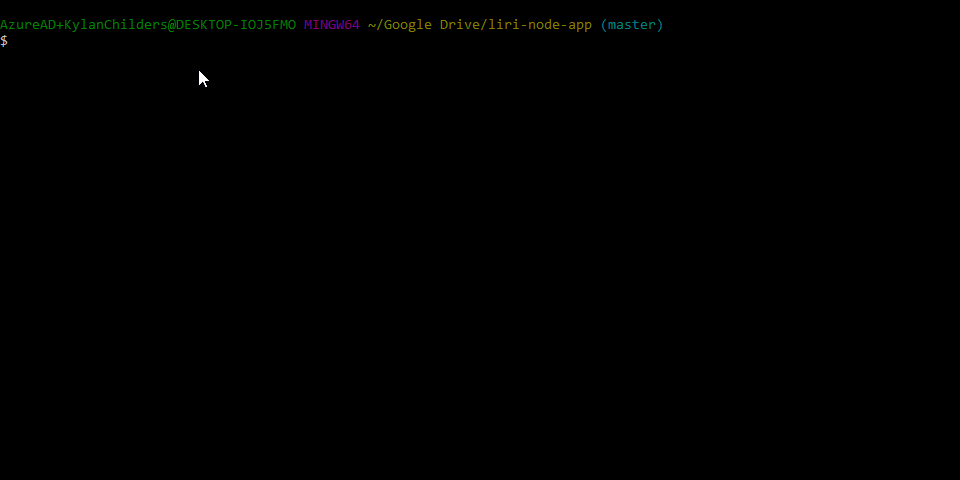

# liri-node-app

LIRI is a node command line application that uses the axios, fs, and node-spotify-api node packages to query Spotify, OMDB, and bandsintown for songs, movies, and concert dates respectively.

